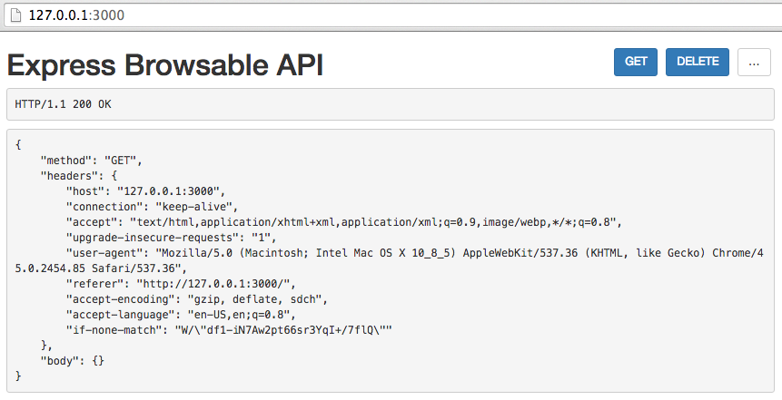
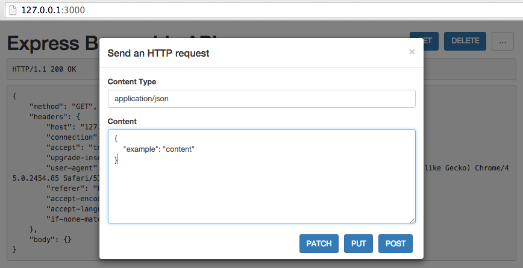

# Express Browsable API

*A demonstration of using content negotiation to render browsable Web APIs in Node.js / Express.*

## Motivation

Web APIs that can render as HTML when accessed in a web browser present a more usable, universal and accessible interface.

The [Django REST framework](http://www.django-rest-framework.org) project is a current example of this, but I believe that it would be beneficial to see the practice extend into other languages and frameworks.

This project demonstrates creating a Web browsable API in Node.js, using the Express micro-framework.

The components we require in order to achieve this:

* A content negotiation middleware that renders either `text/html` or `application/json` depending on the client `Accept` header.
* A template for rendering the HTML responses, along with API controls.
* The [ajax-form](https://github.com/tomchristie/ajax-form/) library for supporting method and content type overriding on HTML forms.

## Installation

Clone the repository, install the dependancies and start the server:

    git clone git@github.com:tomchristie/express-browsable-api.git
    cd express-browsable-api
    npm install
    node server.js

The service will now be running on `http://127.0.0.1:3000`

## Demonstration

The example server will respond to any route, returning information on the request method, headers, and any JSON content in the request body, if it exists.

Make an HTTP request using `curl`, and the server will return a JSON response:

    $ curl 127.0.0.1:3000
    {
        "method": "GET",
        "headers": {
            "user-agent": "curl/7.28.1",
            "host": "127.0.0.1:3000",
            "accept": "*/*"
        },
        "body": {}
    }

Enter the same URL in the browser, and the server will return HTML, including the rendered JSON content, along with controls for making further requests to the API.

## Usage

If using the Express browsable API in your own project, you need to use the `res.sendData()` method in your routes, rather than the usual `res.send()`.

The content negotiation middleware will then render the data into either JSON or HTML, as appropriate.

For example, use this:

    res.sendData({'hello': 'world'})

And not this:

    req.send(JSON.stringify({'hello': 'world'}))

## Extending the project

Some thoughts on extending the functionality of the project…

* Use API schemas or similar to generate appropriate HTML form inputs for any given endpoint instead of the free-form JSON input.
* Use the the response `Allow` header to determine which methods to display.
* Add support for authentication headers to be set be the client which are persisted across requests.
* Render the application response headers in the HTML content.
* Hyperlink any URLs in the HTML content or relation headers to enhance the browsability of APIs that use hyperlinked resources.

## License

Copyright &copy; 2015, Tom Christie
All rights reserved.

Redistribution and use in source and binary forms, with or without
modification, are permitted provided that the following conditions are met:

Redistributions of source code must retain the above copyright notice, this
list of conditions and the following disclaimer.
Redistributions in binary form must reproduce the above copyright notice, this
list of conditions and the following disclaimer in the documentation and/or
other materials provided with the distribution.

THIS SOFTWARE IS PROVIDED BY THE COPYRIGHT HOLDERS AND CONTRIBUTORS "AS IS" AND
ANY EXPRESS OR IMPLIED WARRANTIES, INCLUDING, BUT NOT LIMITED TO, THE IMPLIED
WARRANTIES OF MERCHANTABILITY AND FITNESS FOR A PARTICULAR PURPOSE ARE
DISCLAIMED. IN NO EVENT SHALL THE COPYRIGHT HOLDER OR CONTRIBUTORS BE LIABLE
FOR ANY DIRECT, INDIRECT, INCIDENTAL, SPECIAL, EXEMPLARY, OR CONSEQUENTIAL
DAMAGES (INCLUDING, BUT NOT LIMITED TO, PROCUREMENT OF SUBSTITUTE GOODS OR
SERVICES; LOSS OF USE, DATA, OR PROFITS; OR BUSINESS INTERRUPTION) HOWEVER
CAUSED AND ON ANY THEORY OF LIABILITY, WHETHER IN CONTRACT, STRICT LIABILITY,
OR TORT (INCLUDING NEGLIGENCE OR OTHERWISE) ARISING IN ANY WAY OUT OF THE USE
OF THIS SOFTWARE, EVEN IF ADVISED OF THE POSSIBILITY OF SUCH DAMAGE.